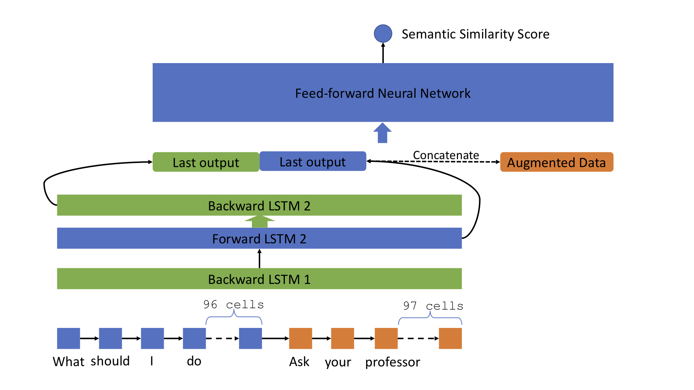

# Machine Based Community Question Answering

## Task Description

The demand of Community Question Answering (cQA) proliferates throughout the advancement of the Internet. However, with a large number of questions and answers available online, it takes efforts to manually go through all possible answers to find the best one of a certain question. Therefore, using technology to automatically carry out answer selections and question retrieval makes it easy for people to find related answers to questions on the Internet. Inspired by the SemEval 2016 Task 3 [1], in this project, we set out to find a way to let a computer program to do two tasks related to the cQA problem, which are described in the following:	
		
  * Question Retrieval(QR): Given a new question and a collection of questions, rerank those questions in the list by their relevance to the new question;				
  * Answer Selection(AS): Given a cQA thread which contains a question and its answers, rerank the answers according to their relevance to the new question.

## Directories Organization

This project contains 4 models in total to address 2 problems above.
The organization of the code and data is the following:

```
.+-README.md
 |-img
 |-bidirectionalLSTM_*.ipynb
 |-text2vec_*.ipynb
 |-validation_*.ipynb
 |-GoogleNews-vectors-negative300.bin
 +-v3.2
   |-README.txt
   +-train
   | |-SemEval2016-Task3*.xml
   +-test
     |-SemEval2016-Task3*.xml
```

The ``GoogleNews-vectors-negative300.bin`` file is the pre-trained _word2vec_ model which can be downloaded [here](https://code.google.com/archive/p/word2vec/).
We don't add this file to the repository since it's too big.

The ``v3.2`` folder contains the training and testing data from the SemEval 2016 Task3 which can be downloaded [here](http://alt.qcri.org/semeval2016/task3/index.php?id=data-and-tools).
Our repository already contains these data.

Other ``*.ipynb`` files are the preprocessing, training and testing code for different tasks and models.
Each file will be detailed explained in the model sections below.

## Prerequisites

1. Python 3.6+
1. Jupyter notebook
1. TensorFlow r1.10+
1. numpy
1. gensim

## Basic Bidirectional LSTM model for the Answer Selection task

The basic bidirectional LSTM model is based on [2].
First we need to run ``text2vec_qa.ipynb`` to generate the training data ``cQA_train_embedding.npz`` and testing data ``cQA_test_embedding.npz``.

Then run the ``bidirectionalLSTM_qa_basic.ipynb`` to train the model.
The trained model and will be saved in a folder starting with ``result_qa_basic_``.
The corresponding tensorboard plot is also saved in its ``/tensorboard`` directory.

Finally, run the ``validation_qa_basic.ipynb`` to evaluate the ranking performance using MAP and MRR matrices.

In our experiment, the MAP achieved is 74.74% and the MRR is 82.33%.

## Bidirectional LSTM model for the Question Retrieval task

Similar to the AS model,
first we need to run ``text2vec_qq.ipynb`` to generate the training data ``cQQ_train_embedding.npz`` and testing data ``cQQ_test_embedding.npz``.

Then run the ``bidirectionalLSTM_qq.ipynb`` to train the model.
The trained model and will be saved in a folder starting with ``result_qq_``.
The corresponding tensorboard plot is also saved in its ``/tensorboard`` directory.

Finally, run the ``validation_qq.ipynb`` to evaluate the ranking performance using MAP and MRR matrices.

In our experiment, the MAP achieved is 74.43% and the MRR is 84.04%.

## Optimized bLSTM model for the Answer Selection task

Even though the basic BLSTM model achieves satisfied performance.
It's very complex and costs a long time to train.
Thus we built an optimized model as shown in Figure 1.


*Figure 1. Optimized model structure*

Since we use the ``dynamic_lstm`` is this optimized model, we need the real length of each question/comment as input.
So we need to do the preprocessing again by running ``text2vec_qa_with_len.ipynb``.
It will generate the training data ``cQA_train_embedding_wlen.npz`` and testing data ``cQA_test_embedding_wlen.npz``.

Then run the ``bidirectionalLSTM_wlen_conc_dropout.ipynb`` to train and evaluate the model.

Our experiment shows a performance as MAP: 74.52% and MRR: 82.15%.
Notice that there isn't any performance drop by simplifying the model.
In addition, since our optimized model uses much fewer parameters and skips the unnecessary computations, the training speed is improved significantly.
The experiment shows a 15% speed boost compared to our original model.

## Other Attempts

The models above are the optimal models we find.
We also try other models and achieves similar performance.
One of the model is shown in Figure 2.

To run train and test this model, simply run ``bidirectionalLSTM_wlen_share_lastlayer_dropout.ipynb``.
We observe the performance MAP: 72.45% and MRR: 80.40% from our experiment.
If we further fine-tune this model, it may achieve better performance.

## References

[1] Nakov Preslav, Marquesz Lluis, Moschittim Alessan- dro, Magdy Walid, Mubarak Hamdy, Freihat, and Abed Alhakim. 2016. Semeval-2016 task 3: Com- munity question answering. In _Semantic Evaluation 2016_. Proceedings of the 10th International Work- shop on Semantic Evaluation.

[2] Henry Nassif, Mitra Mohtarami, and James Glass. 2016. Learning semantic relatedness in commu- nity question answering using neural models. In _Proceedings of the 1st Workshop on Representation Learning for NLP_, pages 137–147.
